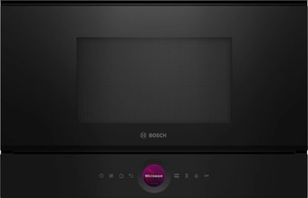
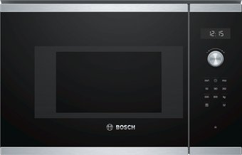
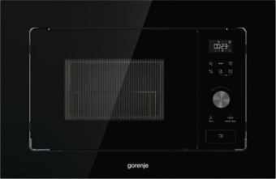
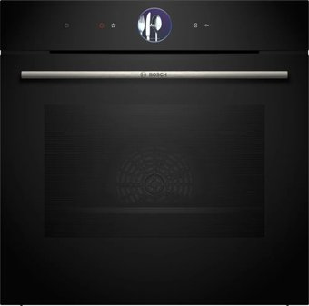
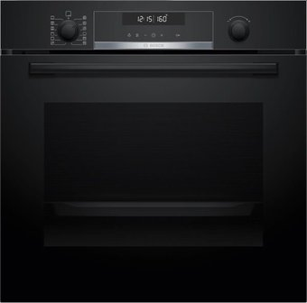
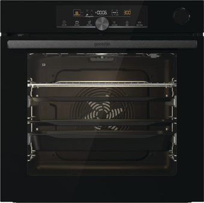

# 🍳 Kitchen Appliance Sets Comparison

This document organizes your kitchen renovation appliance selections into three distinct budget and feature tiers. Each item in the **Primary Set** links to a dedicated detail sheet explaining why it was chosen, key technical specs, and potential concerns.

---

## 📸 Visual Column Comparison

Below is a side-by-side visualization of how the microwave and oven stack up in a column in your kitchen layout:

<table style="width: 100%; table-layout: fixed; border-collapse: collapse; text-align: center;">
  <thead>
    <tr style="border-bottom: 2px solid var(--border-color, #ccc);">
      <th style="width: 33.33%; text-align: center; padding: 10px;">🌟 Primary Set (Premium)</th>
      <th style="width: 33.33%; text-align: center; padding: 10px;">⚖️ Alternative Set 2 (Balanced)</th>
      <th style="width: 33.33%; text-align: center; padding: 10px;">💰 Alternative Set 3 (Economy)</th>
    </tr>
  </thead>
  <tbody>
    <tr>
      <td style="padding: 5px 10px 0 10px; font-weight: bold;">Bosch BFL7221B1 (Serie 8)</td>
      <td style="padding: 5px 10px 0 10px; font-weight: bold;">Bosch BFL524MS0 (Serie 6)</td>
      <td style="padding: 5px 10px 0 10px; font-weight: bold;">Gorenje BM201AG1BG</td>
    </tr>
    <tr>
      <td style="vertical-align: bottom; padding: 0 10px; border: none;">
        
      </td>
      <td style="vertical-align: bottom; padding: 0 10px; border: none;">
        
      </td>
      <td style="vertical-align: bottom; padding: 0 10px; border: none;">
        
      </td>
    </tr>
    <tr>
      <td style="vertical-align: top; padding: 0 10px; border: none;">
        
      </td>
      <td style="vertical-align: top; padding: 0 10px; border: none;">
        
      </td>
      <td style="vertical-align: top; padding: 0 10px; border: none;">
        
      </td>
    </tr>
    <tr style="border-bottom: 1px solid var(--border-color, #ccc);">
      <td style="padding: 0 10px 10px 10px; font-weight: bold;">Bosch HBG7764B1 (Serie 8)</td>
      <td style="padding: 0 10px 10px 10px; font-weight: bold;">Bosch HBG578EB3 (Serie 6)</td>
      <td style="padding: 0 10px 10px 10px; font-weight: bold;">Gorenje BPSA6747A08BG</td>
    </tr>
  </tbody>
</table>

---

## 📊 Summary of Appliance Sets

| Appliance      | 🌟 Primary Set (Premium/Pro)              | ⚖️ Alternative Set 2 (Balanced Quality) | 💰 Alternative Set 3 (Smart Economy) |
| :------------- | :---------------------------------------- | :-------------------------------------- | :----------------------------------- |
| **Oven**       | [[Bosch_HBG7764B1_Oven]] (4,906р.)        | Bosch HBG578EB3 (2,540р.)               | Gorenje BPSA6747A08BG (2,499р.)      |
| **Microwave**  | [[Bosch_BFL7221B1_Microwave]] (2,379р.)   | Bosch BFL524MS0 (1,014р.)               | Gorenje BM201AG1BG (1,134р.)         |
| **Cooktop**    | [[Bosch_PIF63KHC1E_Cooktop]] (2,168р.)    | Bosch PIE631HB1E (1,386р.)              | Electrolux EIT61443B (1,289р.)       |
| **Dishwasher** | [[Bosch_SMV8YCX02E_Dishwasher]] (2,999р.) | Bosch SMV6ECX08E (3,122р.)              | Gorenje GV643E90 (1,639р.)           |
| **Hood**       | [[Bosch_DHL555BL_Hood]] (1,431р.)         | [[Bosch_DHL555BL_Hood]] (1,431р.)       | MAUNFELD Crosby Singolo 60 (450р.)   |
| **Release Years** | Oven/MW: **2023 - 2024**                  | Oven/MW: **2020**                         | Oven/MW: **2021**                    |
| **TOTAL**      | **13,883 rubles**                         | **9,493 rubles**                        | **7,011 rubles**                     |

---

## 1. 🌟 Primary Set: "Premium & Professional"
**Target**: Perfect column aesthetics (Serie 8 matching), ultimate cooking results (3-point probe), zero-grease maintenance (pyrolysis), and maximum drying performance (zeolite).

* **Aesthetic Focus**: Single Column alignment of Oven and Microwave (unified Serie 8 interface and digital ring).
* **Usability Focus**: 28 cm circular burner for large family pans.
* **Cleaning Focus**: Full Pyrolysis (500°C) burning all grease.
* **Details**: Read the individual logs for details:
  - [[Bosch_HBG7764B1_Oven]]
  - [[Bosch_BFL7221B1_Microwave]]
  - [[Bosch_PIF63KHC1E_Cooktop]]
  - [[Bosch_SMV8YCX02E_Dishwasher]]
  - [[Bosch_DHL555BL_Hood]]

---

## 2. ⚖️ Alternative Set 2: "Balanced Quality" (Bosch Serie 6 Focus)
**Target**: Saves ~4,200 rubles while retaining Bosch quality, Pyrolysis, and Zeolite drying.

* **Oven (Bosch HBG578EB3 - 2,540р.)**: Keeps pyrolysis and 3D hot air. Replaces the touch ring and TFT display with retractable rotary dials and a standard white LCD. Replaces the 3-point probe with a 1-point probe. A highly available black glass alternative to the HBG578BB0.
* **Microwave (Bosch BFL524MS0 - 1,014р.)**: Built-in Serie 6 microwave. Visually matches the Serie 6 oven perfectly in black glass and steel, but uses standard buttons and rotary control instead of the touch ring.
* **Cooktop (Bosch PIE631HB1E - 1,386р.)**: Standard induction hob with DirectSelect slider. Retains Bosch's reliable induction heating but drops the 28 cm extra-large ring, using standard size burners (max 21 cm). Available replacement for PIE631FB1E.
* **Dishwasher (Bosch SMV6ECX08E - 3,122р.)**: Serie 6 dishwasher with flexible loading baskets and quiet operation. An in-stock, highly reliable replacement for the out-of-stock SMV6ZDX49E.
* **Hood (Bosch DHL555BL - 1,431р.)**: Kept the same professional dual-motor German-made hood, as it is already the best value for money in terms of pure performance.

---

## 3. 💰 Alternative Set 3: "Smart Economy" (Gorenje & Electrolux Mix)
**Target**: Drops the total budget to **7,011 rubles** (saving nearly 50% of the primary set) while still delivering Pyrolysis, a meat probe, and huge cooking surfaces.

* **Oven (Gorenje BPSA6747A08BG - 2,499р.)**: An excellent balanced choice. Offers **full pyrolysis**, a massive 77-liter volume, **SteamAssist** (steam-infused baking), **IconTouch** touch controls, and includes the **BakeSensor** meat probe to cook meat to perfect core temperature.
* **Microwave (Gorenje BM201AG1BG - 1,134р.)**: Built-in microwave in full black glass finish. Visually matches the black Gorenje BPSA6747A08BG oven perfectly.
* **Cooktop (Electrolux EIT61443B - 1,289р.)**: Features a highly responsive touch slider interface and a layout optimized for large cookware. Available replacement for the out-of-stock IPE6440KF.
* **Dishwasher (Gorenje GV643E90 - 1,639р.)**: 16-place setting dishwasher. Uses **TotalDry (auto-door opening)** at the end of the cycle. A highly available and cost-effective replacement for the GV673C62.
* **Hood (MAUNFELD Crosby Singolo 60 - 450р.)**: Simple built-in hood. Uses a single motor but offers decent 600 m³/h capacity.
