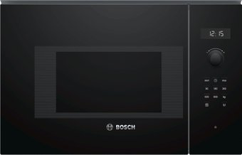

# 🍳 Kitchen Appliance Sets Comparison

This document organizes your kitchen renovation appliance selections into three distinct budget and feature tiers. Each item in the **Primary Set** links to a dedicated detail sheet explaining why it was chosen, key technical specs, and potential concerns.

---

## 📸 Visual Column Comparison

Below is a side-by-side visualization of how the microwave and oven stack up in a column in your kitchen layout:

<table style="width: 100%; table-layout: fixed; border-collapse: collapse; text-align: center;">
  <thead>
    <tr style="border-bottom: 2px solid var(--border-color, #ccc);">
      <th style="width: 33.33%; text-align: center; padding: 10px;">🌟 Primary Set (Premium)</th>
      <th style="width: 33.33%; text-align: center; padding: 10px;">⚖️ Alternative Set 2 (Balanced)</th>
      <th style="width: 33.33%; text-align: center; padding: 10px;">🔥 Alternative Set 3 (Gorenje Full-Featured)</th>
    </tr>
  </thead>
  <tbody>
    <tr>
      <td style="padding: 5px 10px 2px 10px; font-weight: bold;">Bosch BFL7221B1 (Serie 8)</td>
      <td style="padding: 5px 10px 2px 10px; font-weight: bold;">Bosch BFL524MB0 (Serie 6)</td>
      <td style="padding: 5px 10px 2px 10px; font-weight: bold;">Gorenje BM201AG1BG</td>
    </tr>
    <tr>
      <td style="padding: 0 10px; border: none; line-height: 0;">
        

          
          
        

      </td>
      <td style="padding: 0 10px; border: none; line-height: 0;">
        

          
          
        

      </td>
      <td style="padding: 0 10px; border: none; line-height: 0;">
        

          
          
        

      </td>
    </tr>
    <tr style="border-bottom: 1px solid var(--border-color, #ccc);">
      <td style="padding: 2px 10px 10px 10px; font-weight: bold;">Bosch HBG7764B1 (Serie 8)</td>
      <td style="padding: 2px 10px 10px 10px; font-weight: bold;">Bosch HBG578EB3 (Serie 6)</td>
      <td style="padding: 2px 10px 10px 10px; font-weight: bold;">Gorenje BPSA6747A08BG</td>
    </tr>
    <tr style="border-bottom: 2px solid var(--border-color, #ccc); background-color: var(--background-secondary, #f9f9f9); font-weight: bold;">
      <td style="padding: 8px 10px;">💰 7,285 BYN Oven + Microwave</td>
      <td style="padding: 8px 10px;">💰 3,599 BYN Oven + Microwave</td>
      <td style="padding: 8px 10px;">💰 3,633 BYN Oven + Microwave</td>
    </tr>
  </tbody>
</table>

---

## 📊 Summary of Appliance Sets

<table style="width: 100%; table-layout: fixed; border-collapse: collapse; text-align: left; word-break: break-word;">
  <thead>
    <tr style="border-bottom: 2px solid var(--border-color, #ccc); background-color: var(--background-secondary, #f9f9f9);">
      <th style="width: 16%; padding: 8px;">Appliance</th>
      <th style="width: 28%; padding: 8px;">🌟 Primary Set (Premium/Pro)</th>
      <th style="width: 28%; padding: 8px;">⚖️ Alternative Set 2 (Balanced Quality)</th>
      <th style="width: 28%; padding: 8px;">🔥 Alternative Set 3 (Gorenje Full-Featured)</th>
    </tr>
  </thead>
  <tbody>
    <tr style="border-bottom: 1px solid var(--border-color, #eee);">
      <td style="padding: 8px; font-weight: bold;">Oven</td>
      <td style="padding: 8px;"><a class="internal-link" href="Bosch_HBG7764B1_Oven">Bosch HBG7764B1</a> (4,906 BYN)</td>
      <td style="padding: 8px;">Bosch HBG578EB3 (2,540 BYN)</td>
      <td style="padding: 8px;">Gorenje BPSA6747A08BG (2,499 BYN)</td>
    </tr>
    <tr style="border-bottom: 1px solid var(--border-color, #eee);">
      <td style="padding: 8px; font-weight: bold;">Microwave</td>
      <td style="padding: 8px;"><a class="internal-link" href="Bosch_BFL7221B1_Microwave">Bosch BFL7221B1</a> (2,379 BYN)</td>
      <td style="padding: 8px;">Bosch BFL524MB0 (1,059 BYN)</td>
      <td style="padding: 8px;">Gorenje BM201AG1BG (1,134 BYN)</td>
    </tr>
    <tr style="border-bottom: 1px solid var(--border-color, #eee);">
      <td style="padding: 8px; font-weight: bold;">Cooktop</td>
      <td style="padding: 8px;"><a class="internal-link" href="Bosch_PIF63KHC1E_Cooktop">Bosch PIF63KHC1E</a> (2,168 BYN)</td>
      <td style="padding: 8px;">Bosch PIE631HB1E (1,386 BYN)</td>
      <td style="padding: 8px;">Electrolux EIT61443B (1,289 BYN)</td>
    </tr>
    <tr style="border-bottom: 1px solid var(--border-color, #eee);">
      <td style="padding: 8px; font-weight: bold;">Dishwasher</td>
      <td style="padding: 8px;"><a class="internal-link" href="Bosch_SMV8YCX02E_Dishwasher">Bosch SMV8YCX02E</a> (2,999 BYN)</td>
      <td style="padding: 8px;">Bosch SMV6ECX08E (3,122 BYN)</td>
      <td style="padding: 8px;">Gorenje GV643E90 (1,639 BYN)</td>
    </tr>
    <tr style="border-bottom: 1px solid var(--border-color, #eee);">
      <td style="padding: 8px; font-weight: bold;">Hood</td>
      <td style="padding: 8px;"><a class="internal-link" href="Bosch_DHL555BL_Hood">Bosch DHL555BL</a> (1,431 BYN)</td>
      <td style="padding: 8px;"><a class="internal-link" href="Bosch_DHL555BL_Hood">Bosch DHL555BL</a> (1,431 BYN)</td>
      <td style="padding: 8px;">MAUNFELD Crosby Singolo 60 (450 BYN)</td>
    </tr>
    <tr style="border-bottom: 1px solid var(--border-color, #eee);">
      <td style="padding: 8px; font-weight: bold;">Release Years</td>
      <td style="padding: 8px;">Oven/MW: <strong>2023 - 2024</strong></td>
      <td style="padding: 8px;">Oven/MW: <strong>2020</strong></td>
      <td style="padding: 8px;">Oven/MW: <strong>2021</strong></td>
    </tr>
    <tr style="border-bottom: 2px solid var(--border-color, #ccc); font-weight: bold; background-color: var(--background-secondary, #f9f9f9);">
      <td style="padding: 8px;">TOTAL</td>
      <td style="padding: 8px;">13,883 BYN</td>
      <td style="padding: 8px;">9,538 BYN</td>
      <td style="padding: 8px;">7,011 BYN</td>
    </tr>
  </tbody>
</table>

---

## 1. 🌟 Primary Set: "Premium & Professional"
**Target**: Perfect column aesthetics (Serie 8 matching), ultimate cooking results (3-point probe), zero-grease maintenance (pyrolysis), and maximum drying performance (zeolite).

* **Aesthetic Focus**: Single Column alignment of Oven and Microwave (unified Serie 8 interface and digital ring).
* **Usability Focus**: 28 cm circular burner for large family pans.
* **Cleaning Focus**: Full Pyrolysis (500°C) burning all grease.
* **Details**: Read the individual logs for details:
  - [[Bosch_HBG7764B1_Oven]]
  - [[Bosch_BFL7221B1_Microwave]]
  - [[Bosch_PIF63KHC1E_Cooktop]]
  - [[Bosch_SMV8YCX02E_Dishwasher]]
  - [[Bosch_DHL555BL_Hood]]

---

## 2. ⚖️ Alternative Set 2: "Balanced Quality" (Bosch Serie 6 Focus)
**Target**: Saves ~4,300 BYN while retaining Bosch quality, Pyrolysis, and Zeolite drying.

* **Oven (Bosch HBG578EB3 - 2,540 BYN)**: Keeps pyrolysis and 3D hot air. Replaces the touch ring and TFT display with retractable rotary dials and a standard white LCD. Replaces the 3-point probe with a 1-point probe. A highly available black glass alternative to the HBG578BB0.
* **Microwave (Bosch BFL524MB0 - 1,059 BYN)**: Built-in Serie 6 microwave in **full black glass** finish. A direct color match for the HBG578EB3 oven — both share the all-black front face with no stainless trim. Replaces the originally listed BFL524MS0 (which had a stainless steel border incompatible with the all-black oven). Same core specs: 20 L, 800 W, AutoPilot 7.
* **Cooktop (Bosch PIE631HB1E - 1,386 BYN)**: Standard induction hob with DirectSelect slider. Retains Bosch's reliable induction heating but drops the 28 cm extra-large ring, using standard size burners (max 21 cm). Available replacement for PIE631FB1E.
* **Dishwasher (Bosch SMV6ECX08E - 3,122 BYN)**: Serie 6 dishwasher with flexible loading baskets and quiet operation. An in-stock, highly reliable replacement for the out-of-stock SMV6ZDX49E.
* **Hood (Bosch DHL555BL - 1,431 BYN)**: Kept the same professional dual-motor German-made hood, as it is already the best value for money in terms of pure performance.

---

## 3. 🔥 Alternative Set 3: "Gorenje Full-Featured" (Gorenje & Electrolux Mix)
**Target**: Total budget **7,011 BYN** — comparable in price to Set 2 but from a different brand ecosystem, delivering Pyrolysis, SteamAssist, a meat probe, and a massive 77-liter oven cavity.

* **Oven (Gorenje BPSA6747A08BG - 2,499 BYN)**: An excellent balanced choice. Offers **full pyrolysis**, a massive 77-liter volume, **SteamAssist** (steam-infused baking), **IconTouch** touch controls, and includes the **BakeSensor** meat probe to cook meat to perfect core temperature.
* **Microwave (Gorenje BM201AG1BG - 1,134 BYN)**: Built-in microwave in full black glass finish. Visually matches the black Gorenje BPSA6747A08BG oven perfectly.
* **Cooktop (Electrolux EIT61443B - 1,289 BYN)**: Features a highly responsive touch slider interface and a layout optimized for large cookware. Available replacement for the out-of-stock IPE6440KF.
* **Dishwasher (Gorenje GV643E90 - 1,639 BYN)**: 16-place setting dishwasher. Uses **TotalDry (auto-door opening)** at the end of the cycle. A highly available and cost-effective replacement for the GV673C62.
* **Hood (MAUNFELD Crosby Singolo 60 - 450 BYN)**: Simple built-in hood. Uses a single motor but offers decent 600 m³/h capacity.
