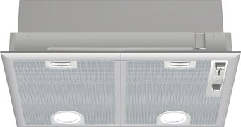

# 🏷️ Bosch DHL555BL Hood (Serie 4)

* **Category**: Built-in Range Hood (60 cm)
* **Price**: ~1,431 rubles
* **Key Specifications**: Serie 4, Dual-motor, max capacity 618 m³/h, slider controls, assembled in Germany.
* **Market Release / Years**: **2015 - 2026** (Long-running reliable Serie 4 line)

---

## 📸 Product Image

---

## 🎯 Why It Was Selected

1. **Dual-Motor Power**:
   - **Reasoning**: A range hood's core function is moving air. The DHL555BL utilizes a **dual-motor setup** which provides a high extraction rate of up to **618 m³/h**. This handles heavy steam, frying grease, and odors, protecting your kitchen cabinets from moisture damage.
2. **Rejection of Marketing: Manual vs. Wi-Fi & Sensors**:
   - **Reasoning**: We avoided expensive hoods with "smart sensors" or Wi-Fi control (Home Connect). A hood is easily operated by a manual sliding switch. Avoiding sensors eliminates failure points caused by grease accumulation over time.
3. **German Assembly & Build Quality**:
   - **Reasoning**: Unlike many budget hoods assembled from generic parts, this model is built in Germany. The quality of the motors, blades, and steel filters is high, ensuring longevity.
4. **Discreet Built-in Design**:
   - **Reasoning**: The hood is fully integrated into the upper cabinet, making it invisible in the kitchen layout. This means we did not need to match its external look with the Serie 8 column, saving budget.

---

## ⚠️ Concerns and Technical Risks

* **Noise at Maximum Speed**:
   - **Detail**: With two motors running at maximum speed (Level 3), the noise level reaches **68 dB**. This is loud and can be disruptive in an open kitchen-living room. It is best to run it at Level 1 or 2 for daily cooking.
* **Mechanical Slider Aesthetics**:
   - **Detail**: The mechanical sliding switch feels a bit retro and plastic. While it is highly reliable and cheap to repair, it lacks the modern touch-sensitive feel of other premium appliances.
* **Ducting Requirement**:
   - **Detail**: To achieve the rated 618 m³/h throughput, you must install a wide, smooth-walled plastic duct (120-150 mm) leading to the ventilation shaft. Using narrow corrugated flexible ducts will increase noise and cut performance in half.
