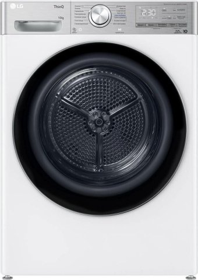
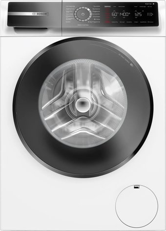

# 🧺 Laundry Appliance Sets Comparison

This document details the comparison between the three primary laundry sets for your family of 4 (2 adults + 2 kids). It evaluates capacity, auto-maintenance, speed, and aesthetics.

---

## 📸 Visual Column Comparison

Below is a side-by-side visualization of how the tumble dryer and washing machine stack up in a column in your laundry room:

<table style="width: 100%; table-layout: fixed; border-collapse: collapse; text-align: center;">
  <thead>
    <tr style="border-bottom: 2px solid var(--border-color, #ccc);">
      <th style="width: 25%; text-align: center; padding: 10px;">🌟 Primary Set (LG V9)</th>
      <th style="width: 25%; text-align: center; padding: 10px;">🎨 Samsung Bespoke (Gen C)</th>
      <th style="width: 25%; text-align: center; padding: 10px;">⚖️ Bosch Serie 8 (ME)</th>
      <th style="width: 25%; text-align: center; padding: 10px;">💎 Bosch Premium (i-DOS)</th>
    </tr>
  </thead>
  <tbody>
    <tr>
      <td style="padding: 5px 10px 0 10px; font-weight: bold;">LG DC10V9V9E (10 kg)</td>
      <td style="padding: 5px 10px 0 10px; font-weight: bold;">Samsung DV90BB9445GHLP</td>
      <td style="padding: 5px 10px 0 10px; font-weight: bold;">Bosch WQB245B0ME (9 kg)</td>
      <td style="padding: 5px 10px 0 10px; font-weight: bold;">Bosch WQB245B40 (9 kg)</td>
    </tr>
    <tr>
      <td style="vertical-align: bottom; padding: 0 10px; border: none;">
        
      </td>
      <td style="vertical-align: bottom; padding: 0 10px; border: none;">
        
      </td>
      <td style="vertical-align: bottom; padding: 0 10px; border: none;">
        
      </td>
      <td style="vertical-align: bottom; padding: 0 10px; border: none;">
        
      </td>
    </tr>
    <tr>
      <td style="vertical-align: top; padding: 0 10px; border: none;">
        
      </td>
      <td style="vertical-align: top; padding: 0 10px; border: none;">
        
      </td>
      <td style="vertical-align: top; padding: 0 10px; border: none;">
        
      </td>
      <td style="vertical-align: top; padding: 0 10px; border: none;">
        
      </td>
    </tr>
    <tr style="border-bottom: 1px solid var(--border-color, #ccc);">
      <td style="padding: 0 10px 10px 10px; font-weight: bold;">LG F4V9LA2W (13 kg)</td>
      <td style="padding: 0 10px 10px 10px; font-weight: bold;">Samsung WW11CB944CGHLP</td>
      <td style="padding: 0 10px 10px 10px; font-weight: bold;">Bosch WGB244040 (9 kg)</td>
      <td style="padding: 0 10px 10px 10px; font-weight: bold;">Bosch WGB244A40 (9 kg)</td>
    </tr>
  </tbody>
</table>

> [!NOTE]
> For the LG V9 stacked column, you will need to purchase the **LG KSTK1** stacking connection kit to securely attach the dryer on top of the washing machine.

---

## 📊 Summary of Laundry Sets

<table style="width: 100%; table-layout: fixed; border-collapse: collapse; text-align: left; word-break: break-word;">
  <thead>
    <tr style="border-bottom: 2px solid var(--border-color, #ccc); background-color: var(--background-secondary, #f9f9f9);">
      <th style="width: 16%; padding: 8px;">Parameter</th>
      <th style="width: 21%; padding: 8px;">🌟 Primary Set (LG V9)</th>
      <th style="width: 21%; padding: 8px;">🎨 Samsung Bespoke (Gen C)</th>
      <th style="width: 21%; padding: 8px;">⚖️ Bosch Serie 8 (ME)</th>
      <th style="width: 21%; padding: 8px;">💎 Bosch Premium (i-DOS)</th>
    </tr>
  </thead>
  <tbody>
    <tr style="border-bottom: 1px solid var(--border-color, #eee);">
      <td style="padding: 8px; font-weight: bold;">Washing Machine</td>
      <td style="padding: 8px;"><a class="internal-link" href="LG_F4V9LA2W_Washing_Machine">LG F4V9LA2W</a></td>
      <td style="padding: 8px;"><a class="internal-link" href="Samsung_WW11CB944CGHLP_Washing_Machine">Samsung WW11CB944CG</a></td>
      <td style="padding: 8px;"><a class="internal-link" href="Bosch_WGB244040_Washing_Machine">Bosch WGB244040</a></td>
      <td style="padding: 8px;"><a class="internal-link" href="Bosch_WGB244A40_Washing_Machine">Bosch WGB244A40</a></td>
    </tr>
    <tr style="border-bottom: 1px solid var(--border-color, #eee);">
      <td style="padding: 8px; font-weight: bold;">Tumble Dryer</td>
      <td style="padding: 8px;"><a class="internal-link" href="LG_DC10V9V9E_Dryer">LG DC10V9V9E</a></td>
      <td style="padding: 8px;"><a class="internal-link" href="Samsung_DV90BB9445GHLP_Dryer">Samsung DV90BB9445</a></td>
      <td style="padding: 8px;"><a class="internal-link" href="Bosch_WQB245B0ME_Dryer">Bosch WQB245B0ME</a></td>
      <td style="padding: 8px;"><a class="internal-link" href="Bosch_WQB245B40_Dryer">Bosch WQB245B40</a></td>
    </tr>
    <tr style="border-bottom: 1px solid var(--border-color, #eee;); font-weight: bold;">
      <td style="padding: 8px;">Total Price</td>
      <td style="padding: 8px; color: var(--text-accent, #1d9bf0);">7,242 р.</td>
      <td style="padding: 8px;">7,198 р.</td>
      <td style="padding: 8px;">7,204 р.</td>
      <td style="padding: 8px;">8,732 р.</td>
    </tr>
    <tr style="border-bottom: 1px solid var(--border-color, #eee);">
      <td style="padding: 8px; font-weight: bold;">Release Years</td>
      <td style="padding: 8px;"><strong>2019 / 2024</strong> (V9 Gen)</td>
      <td style="padding: 8px;"><strong>2023 / 2023</strong> (Gen C)</td>
      <td style="padding: 8px;"><strong>2023 / 2023</strong> (Serie 8)</td>
      <td style="padding: 8px;"><strong>2023 / 2023</strong> (Serie 8)</td>
    </tr>
    <tr style="border-bottom: 1px solid var(--border-color, #eee);">
      <td style="padding: 8px; font-weight: bold;">Color / Design</td>
      <td style="padding: 8px;">White Gloss / Chrome</td>
      <td style="padding: 8px;">Satin Greige / Matte</td>
      <td style="padding: 8px;">White / Classic</td>
      <td style="padding: 8px;">White / Premium</td>
    </tr>
    <tr style="border-bottom: 1px solid var(--border-color, #eee);">
      <td style="padding: 8px; font-weight: bold;">Washing Load</td>
      <td style="padding: 8px; font-weight: bold;">13 kg (Largest)</td>
      <td style="padding: 8px;">11 kg</td>
      <td style="padding: 8px;">9 kg</td>
      <td style="padding: 8px;">9 kg</td>
    </tr>
    <tr style="border-bottom: 1px solid var(--border-color, #eee);">
      <td style="padding: 8px; font-weight: bold;">Drying Load</td>
      <td style="padding: 8px;">10 kg</td>
      <td style="padding: 8px;">9 kg</td>
      <td style="padding: 8px;">9 kg</td>
      <td style="padding: 8px;">9 kg</td>
    </tr>
    <tr style="border-bottom: 1px solid var(--border-color, #eee);">
      <td style="padding: 8px; font-weight: bold;">Auto-Dose</td>
      <td style="padding: 8px;">❌ No</td>
      <td style="padding: 8px; color: var(--text-success, #2ea44f);">✔️ Yes</td>
      <td style="padding: 8px;">❌ No</td>
      <td style="padding: 8px; color: var(--text-success, #2ea44f);">✔️ Yes (i-DOS)</td>
    </tr>
    <tr style="border-bottom: 2px solid var(--border-color, #ccc);">
      <td style="padding: 8px; font-weight: bold;">Dryer Cleaning</td>
      <td style="padding: 8px; font-weight: bold; color: var(--text-success, #2ea44f);">Self-Cleaning</td>
      <td style="padding: 8px;">Manual Radiator</td>
      <td style="padding: 8px; font-weight: bold; color: var(--text-success, #2ea44f);">Self-Cleaning</td>
      <td style="padding: 8px; font-weight: bold; color: var(--text-success, #2ea44f);">Self-Cleaning</td>
    </tr>
  </tbody>
</table>

---

## 🔍 In-Depth Brand Comparison

### 1. 🌟 LG V9 Flagship: "Pure In-Laundry Power" (Recommended)
This set is the most cost-effective and practical choice for a family with 2 children.

* **Massive 13 kg Loading**: A 13 kg drum allows washing two complete sets of family bedding + towels in a single load, saving significant time.
* **Self-Cleaning Condenser**: Tumble dryers accumulate huge amounts of lint from children's clothes and bedding. The LG V9 dryer automatically flushes the condenser with water, eliminating the need to vacuum or wipe out the radiator manually.
* **TurboWash 360**: Fully washes a large load in just 39 minutes.
* **AI DD & Steam+**: AI DD selects optimal drum motions to protect delicate children's cotton clothes, while Steam+ removes 99.9% of allergens.

### 2. ⚖️ Bosch Serie 8 (ME & Premium): "Pragmatic Quality"
The choice for users who value premium build quality, precise dials, and advanced functions.

* **Self-Cleaning Condenser**: Both WQB245B0ME and WQB245B40 dryers feature Bosch’s SelfCleaning Condenser.
* **i-DOS Auto-Dosing**: Available in the Premium WGB244A40 model. You fill the detergent compartment once a month, and the machine automatically doses the exact amount needed.
* **Iron Assist**: The WQB245B40 dryer uses steam to smooth dry clothes, reducing ironing time.
* **Limitation**: The load capacity is restricted to **9 kg**, requiring you to split large bedding loads.

### 3. 🎨 Samsung Bespoke: "Design Centric"
Best suited if the laundry column is in a highly visible hallway or master bathroom, and aesthetics are a top priority.

* **Satin Greige Finish**: Beautiful matte color that stands out from standard white appliances.
* **i-DOS Dosing**: Includes auto-dosing at a reasonable price point.
* **Limitation**: The Samsung dryer **does not** feature a self-cleaning condenser. You must manually clean the lint from the radiator mesh inside the bottom hatch at least once a month.
