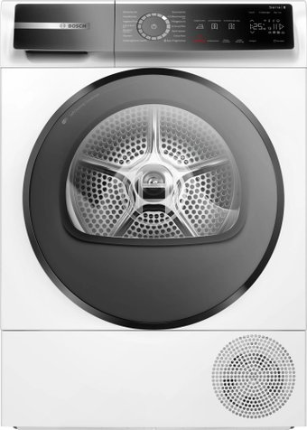

# 🏷️ Bosch WQB245B40 Tumble Dryer (9 kg)

* **Category**: Condensation Tumble Dryer with Heat Pump
* **Price**: Included in the Bosch Premium i-DOS set (~8,732 rubles total)
* **Key Specifications**: 9 kg load, Heat Pump, SelfCleaning Condenser, Iron Assist (steam treatment), Home Connect, SensitiveDrying System.
* **Market Release / Years**: **2023 - 2026** (Premium Serie 8 heat pump with Iron Assist)

---

## 📸 Product Image

---

## 🎯 Why It Was Selected

1. **Iron Assist (Steam Smoothing)**:
   - **Reasoning**: Applies a fine mist of steam to dried clothes at the end of the cycle to release wrinkles. This significantly reduces or completely eliminates the need to iron business shirts, cotton T-shirts, and children's outfits.
2. **SelfCleaning Condenser**:
   - **Reasoning**: Automatically flushes the condenser during drying, preserving A+++ energy efficiency and eliminating manual lint cleaning from the radiator fins.
3. **Advanced Controls & Wi-Fi**:
   - **Reasoning**: Includes premium touch controls, cycle auto-selection linked with the washing machine (via Home Connect), and remote notifications.

---

## ⚠️ Concerns and Technical Risks

* **Higher Cost**:
   - **Detail**: The Iron Assist steam generator and advanced electronics add to the overall purchase price.
