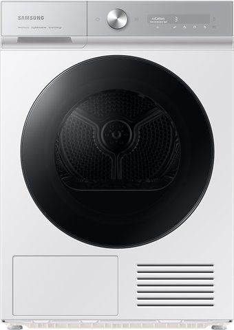

# 🏷️ Samsung DV90BB9445GHLP Tumble Dryer (9 kg)

* **Category**: Heat Pump Tumble Dryer
* **Price**: Included in the Samsung Bespoke set (~7,198 rubles total)
* **Key Specifications**: 9 kg load, Heat Pump technology, AI Dry (sensor drying), Bespoke Matte Finish (Satin Greige), SmartThings Wi-Fi, Auto Cycle Link.
* **Market Release / Years**: **2023 - 2026** (Samsung Bespoke Gen C line)

---

## 📸 Product Image

---

## 🎯 Why It Was Selected

1. **Bespoke Satin Greige Finish**:
   - **Reasoning**: Matching design with the washing machine, creating a gorgeous visual column when stacked.
2. **AI Dry Technology**:
   - **Reasoning**: Multi-sensing technology monitors humidity and temperature to optimize drying performance, preventing clothes from overheating or shrinking.
3. **Auto Cycle Link**:
   - **Reasoning**: Automatically selects the matching drying cycle based on the washing cycle used by the companion washing machine.
4. **Heat Pump Efficiency**:
   - **Reasoning**: Highly energy-efficient closed-loop heating that uses much less electricity than condenser or vented dryers.

---

## ⚠️ Concerns and Technical Risks

* **Manual Condenser Cleaning**:
   - **Detail**: Unlike LG V9 and Bosch Serie 8 dryers, the Samsung Bespoke dryer does not feature a self-cleaning condenser. The user must manually vacuum and wipe the lint off the lower radiator mesh at least once a month.
* **Higher Price**:
   - **Detail**: Premium price tag driven heavily by Bespoke styling rather than technical/mechanical advantages.
